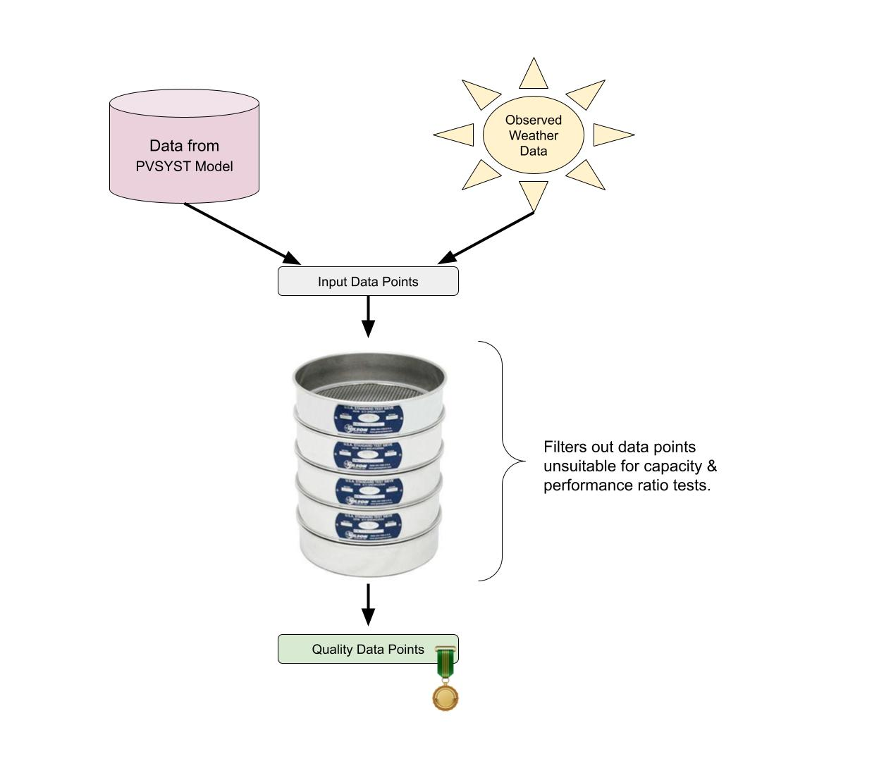

# Capacity Testing Data Point Sieve Stack

A function that filters data points for ASTM 2848-13 capacity and performance ratio tests.

<br/>



<br/>

## What's Here

Custom Types:

- CapacityTestDataPoint: All the input data from observed weather, numbers from the models, and timestamp.

Functions:

- send_through_sieve_stack: Takes a list of one or more CapacityTestDataPoints and returns an _option_ type of either None (when none of the inputs data points are usable) or _some_ containing the usable data points.

<br/>

## Inputs
The CapacityTestDataPoint represents all the inputs needed for the send_through_sieve_stack logic. This includes:

- Raw data from the PVSYST model:
    1. Global Horizontal (GHI) irradiance
    2. Ambient temperature
    3. Wind speed
    4. Correction factors (relevant to calculate plane of array (POA) irradiance)
    5. timestamp

-  Climate and performance data from your data acquisition system:
    1. Temperature
    2. Wind speed
    3. Plane of array (POA) irradiance
    4. Timestamp

<br/>

## Filtering Logic

This is roughly how the sieve stack decides which data points keep and which to filter out.

- 50 / 15-minute points (huh?)
- Exclude data below 400w/m2 
- Exclude data above the clipping point of the inverter 
- Reporting condition POA should be sorted in a +/-20% range 

- temperature sorting requirements?

- wind sorting requirements?

- exclusions applied "because they do not correlate with the performance"? 

<br/>

## Running The Code

Steps for running the Rust code here.

<br/>

### 0) Install 
The command line tool _"cargo"_ is used for this Rust project. It can be easily installed on linux, mac, and windows via [rustup](https://rustup.rs/).

<br/>

### 1) Run Unit Tests 
The unit tests are sets of inputs and expected filtered outputs for different situations in order to check that send_through_sieve_stack function correctly sieves in all cases.
```sh
cargo test
```

<br/>

### 2) Run Locally
Allows you to run the send_through_sieve_stack function with your own custom input data points and inspect the result.

First, edit the `input_data_points.cvs` file with your desired custom input data.

Then run the start command:
```
cargo start
```

<br/>

### 3) Deploy?
Deploy the "send_through_sieve_stack" function and a Rust _library_ so that it can be used... somewhere else?

<br/>

## More Info On ASTM E2848 Capacity Testing

- [ASTM E2848 Capacity Test For Beginners Blog Post](https://www.purepower.com/blog/astm-e2848-capacity-test-for-beginners)

<br/>

## Other Possible Names
Here are some other potential names for this project:

- Sieve Stack 6000
- The Grim Siever
- Sievester Stallone
- Sievezilla
- Keanu Sieves
- A Sieve Data
- Sieve City
- Pure Seive
- Savage Sievage
- Let's Sieve We Can Do This
- New Year's Sieve

  <br/>
